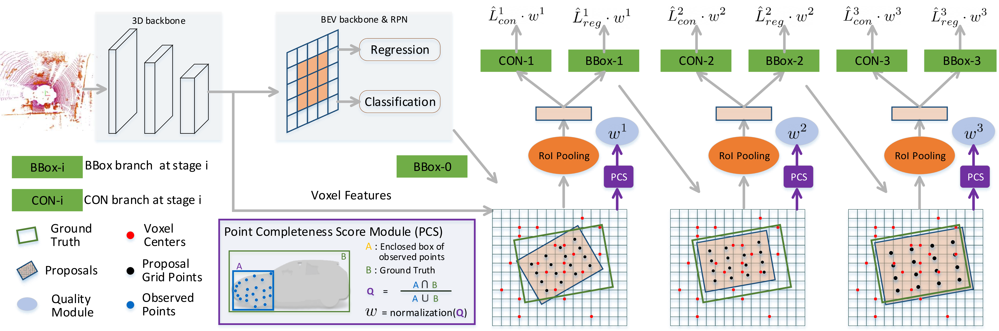
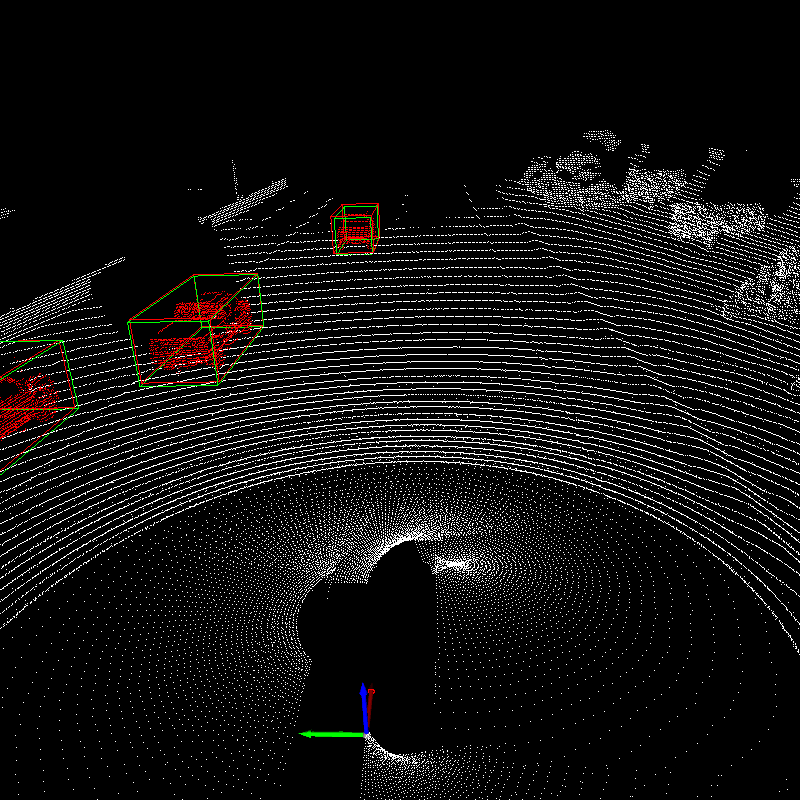
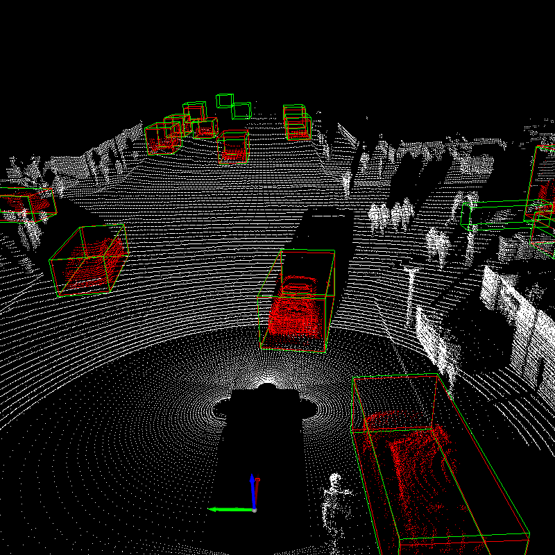
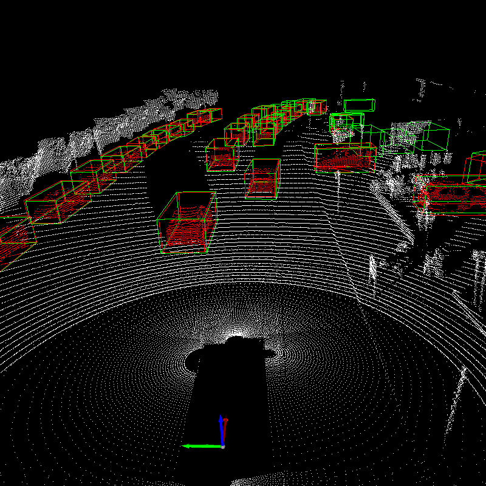
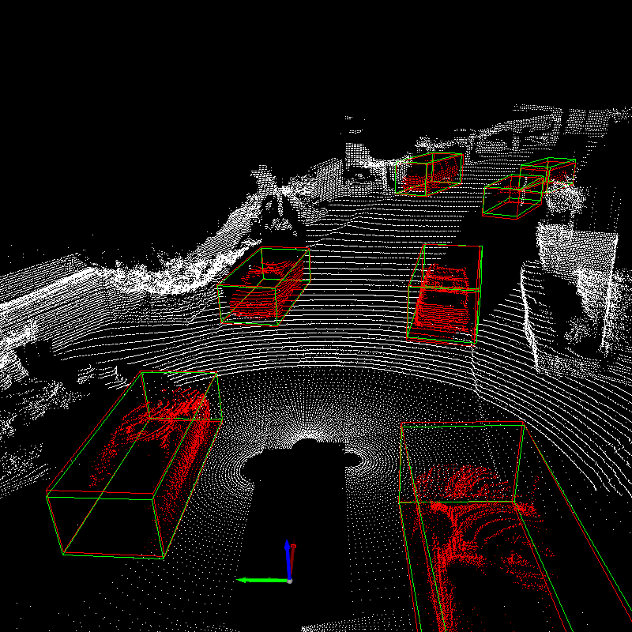
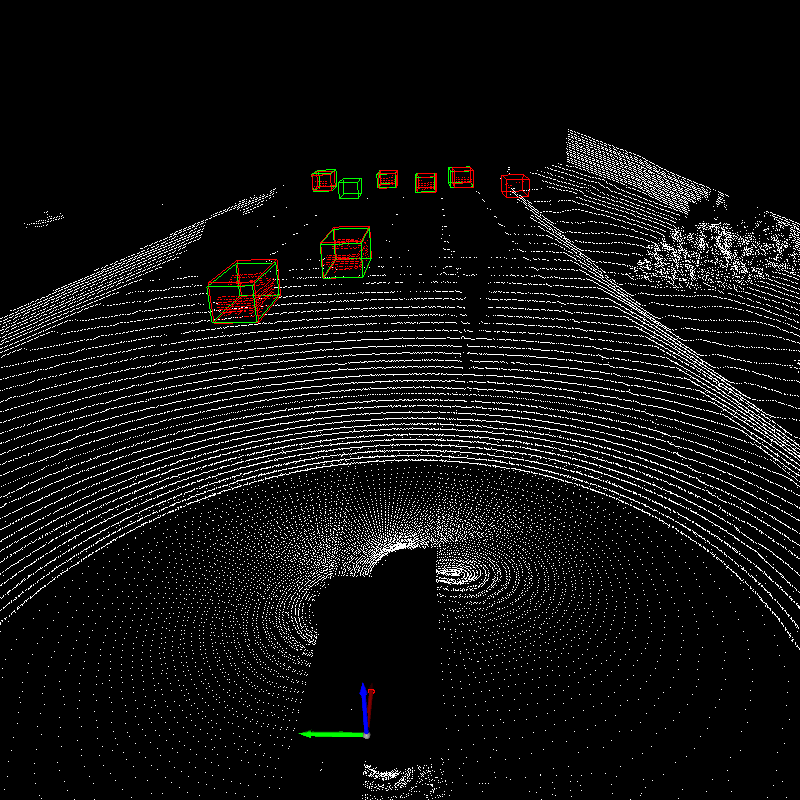
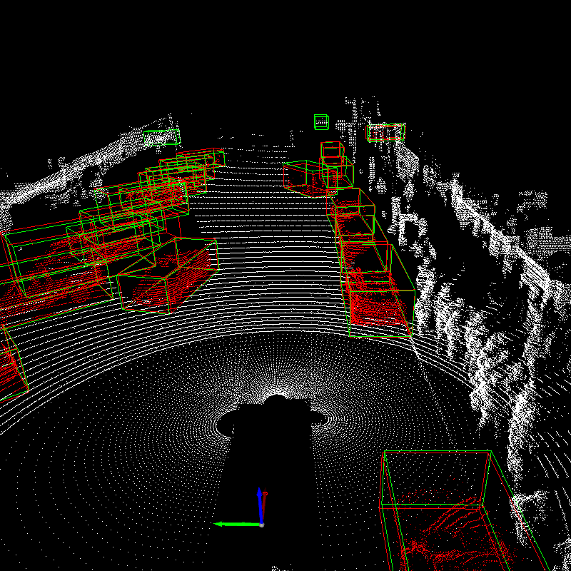

# 3D Cascade RCNN

This is the implementation of **3D Cascade RCNN: High Quality Object Detection in Point Clouds**.
<p align="center">
  
</p>

We designed a 3D object detection model on point clouds by:
* Presenting a simple yet effective 3D cascade architecture
* Analyzing the sparsity of the point clouds use point completeness score to re-weighting training samples.
Following is detection results on Waymo Open Dataset.
<p align="center">
  
  
  
</p>
<p align="center">
  
  
  
</p>

## Results on KITTI

|       | Easy Car | Moderate Car | Hard Car |
| ----- | -------: | :----------: | :------: |
| AP 11 |    90.05 |    86.02     |  79.27   |
| AP 40 |    93.20 |    86.19     |  83.48   |


## Results on Waymo

|               | Overall Vehicle | 0-30m Vehicle | 30-50m Vehicle | 50m-Inf Vehicle |
| ------------- | --------------: | :-----------: | :------------: | :-------------: |
| *LEVEL_1 mAP* |           76.27 |     92.66     |     74.99      |      54.49      |
| *LEVEL_2 mAP* |           67.12 |     91.95     |     68.96      |      41.82      |

## Installation
1.  Requirements. 
The code is tested on the following environment:
* Ubuntu 16.04 with 4 V100 GPUs
* Python 3.7
* Pytorch 1.7
* CUDA 10.1
* spconv 1.2.1

2. Build extensions
```
python setup.py develop
```

## Getting Started

### Prepare for the data.

Please download the official [KITTI](http://www.cvlibs.net/datasets/kitti/eval_object.php?obj_benchmark=3d) dataset and generate data infos by following command:
```
python -m pcdet.datasets.kitti.kitti_dataset create_kitti_infos tools/cfgs/kitti_dataset.yaml
```
The folder should be like:
```
data
├── kitti
│   │── ImageSets
│   │── training
│   │   ├──calib & velodyne & label_2 & image_2
│   │── testing
│   │   ├──calib & velodyne & image_2
|   |── kitti_dbinfos_train.pkl
|   |── kitti_infos_train.pkl
|   |── kitti_infos_val.pkl
```

### Training and evaluation.
    
The configuration file is in tools/cfgs/3d_cascade_rcnn.yaml, and the training scripts is in tools/scripts.
```
cd tools
sh scripts/3d-cascade-rcnn.sh
```

### Test a pre-trained model

The pre-trained KITTI model is at: [model](https://drive.google.com/file/d/1IEDjt02hUSKJy49yCofqjyA2aDcPsX8v/view?usp=sharing). Run with: 
```
cd tools
sh scripts/3d-cascade-rcnn_test.sh
```
The evaluation results should be like: 
```
2021-08-10 14:06:14,608   INFO  Car AP@0.70, 0.70, 0.70:
bbox AP:97.9644, 90.1199, 89.7076
bev  AP:90.6405, 89.0829, 88.4391
3d   AP:90.0468, 86.0168, 79.2661
aos  AP:97.91, 90.00, 89.48
Car AP_R40@0.70, 0.70, 0.70:
bbox AP:99.1663, 95.8055, 93.3149
bev  AP:96.3107, 92.4128, 89.9473
3d   AP:93.1961, 86.1857, 83.4783
aos  AP:99.13, 95.65, 93.03
Car AP@0.70, 0.50, 0.50:
bbox AP:97.9644, 90.1199, 89.7076
bev  AP:98.0539, 97.1877, 89.7716
3d   AP:97.9921, 90.1001, 89.7393
aos  AP:97.91, 90.00, 89.48
Car AP_R40@0.70, 0.50, 0.50:
bbox AP:99.1663, 95.8055, 93.3149
bev  AP:99.1943, 97.8180, 95.5420
3d   AP:99.1717, 95.8046, 95.4500
aos  AP:99.13, 95.65, 93.03
```

## Acknowledge
The code is built on [`OpenPCDet`](https://github.com/open-mmlab/OpenPCDet) and [`Voxel R-CNN`](https://github.com/djiajunustc/Voxel-R-CNN).